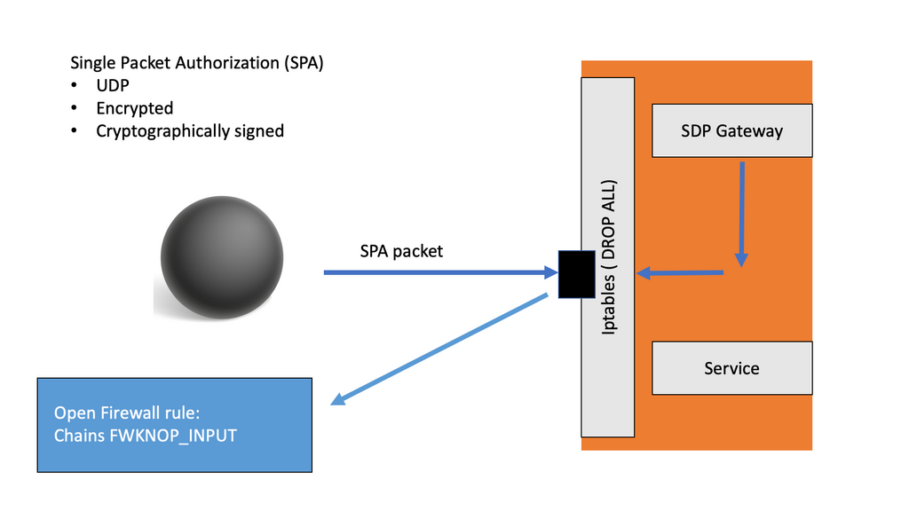

# Software-Defined Perimeter

## Description

This repository contains the code and resources necessary to deploy an architecture based on Software-Defined Perimeters using the open-source implementation made by [WaverleyLabs](https://www.waverleylabs.com/services/software-defined-perimeter-panther-sdp-implementation/). The deployment can be performed both on real machines and devices as well as on a virtualized network architecture using Docker and Docker-Compose to test the functionality of the SDPs.

## Architecture & Components


- **SDP Controller**: The SDP Controller uses the [WaverleyLabs - SDP Controller](https://github.com/waverleylabs/SDPController.git) repository and contains a set of scripts and resources to automate its configuration and deployment. For more information on SDP Controller, see the following sites:
  - [http://www.waverleylabs.com/services/software-defined-perimeter](http://www.waverleylabs.com/services/software-defined-perimeter/)
  - [https://cloudsecurityalliance.org/group/software-defined-perimeter/](https://cloudsecurityalliance.org/group/software-defined-perimeter/)

- **SDP Gateway**: The SDP Gateway uses the open source software [fwknop](https://github.com/mrash/fwknop) which implements an authorization scheme known as Single Packet Authorization (SPA) for strong service concealment. SPA requires only a single packet which is encrypted, non-replayable, and authenticated via an HMAC in order to communicate desired access to a service that is hidden behind a firewall in a default-drop filtering stance. The SDP Gateway uses the iptables firewall to deny all requests to the Accepting Hosts (AH) by default, authorizing only those that have been authorized by the SDP Controller.

- **SDP Client (IH)**: The SDP client or initiating host is responsible for requesting the necessary authorization from the SDP Controller to access the Accepting Hosts (AH) protected by the SDP Gateway.



## Installation and deployment

A

### Configure SDP-Controller

A

### Configure SDP-Gateway

A

### Configure SDP-Client

A

### Start

```bash
$ docker-compose up -d
```

```bash
$ docker exec -it sdp-gateway /bin/bash
$ fwknopd -f

---
(sdp_com.c:423) Setting CA cert for peer cert verification.
(sdp_com.c:622) Starting connection attempt 1
(sdp_com.c:371) Connected with TLS_AES_256_GCM_SHA384 encryption
(sdp_com.c:735) Server certificates:
(sdp_com.c:737) Subject: /C=ES/ST=PA/L=A/O=Uniovi/OU=SE/CN=2/emailAddress=abc@xyz.com
(sdp_com.c:740) Issuer: /C=ES/ST=PA/L=A/O=Uniovi/OU=SE/CN=PhD/emailAddress=abc@xyz.com
(sdp_ctrl_client.c:627) Credentials-good message received
(sdp_message.c:258) Received credential update message
(sdp_ctrl_client.c:637) Credential update received
(sdp_ctrl_client.c:1960) All new credentials stored successfully
(sdp_message.c:272) Received service or access data message
(sdp_ctrl_client.c:675) Access data update received
```

```bash
$ docker exec -it sdp-client /bin/bash
$ /usr/bin/fwknop -n service_gate

---
(sdp_com.c:423) Setting CA cert for peer cert verification.
(sdp_com.c:622) Starting connection attempt 1
(sdp_com.c:371) Connected with TLS_AES_256_GCM_SHA384 encryption
(sdp_com.c:735) Server certificates:
(sdp_com.c:737) Subject: /C=ES/ST=PA/L=A/O=Uniovi/OU=SE/CN=2/emailAddress=abc@xyz.com
(sdp_com.c:740) Issuer: /C=ES/ST=PA/L=A/O=Uniovi/OU=SE/CN=PhD/emailAddress=abc@xyz.com
(sdp_ctrl_client.c:627) Credentials-good message received
(sdp_message.c:258) Received credential update message
(sdp_ctrl_client.c:637) Credential update received
(sdp_ctrl_client.c:1960) All new credentials stored successfully
```